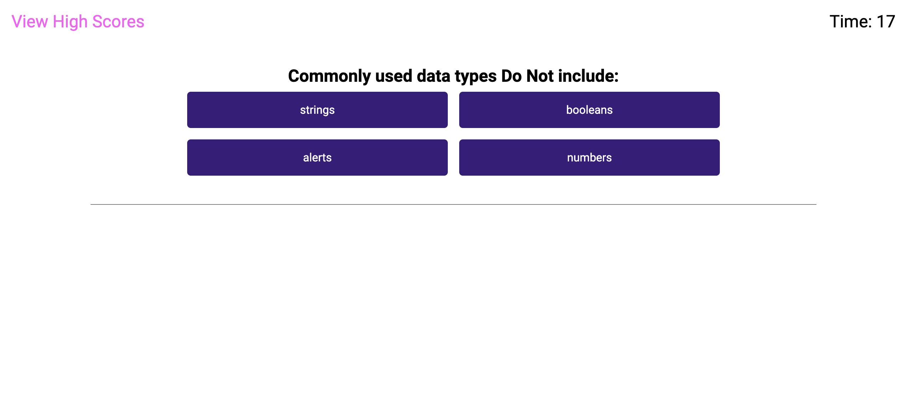

# Coding-Quiz
Create a code quiz for Module 04 Challenge

## Description

This is a project that allows a user to work through a coding quiz. When the 'begin quiz' button is clicked, a timer is triggered that will count down. If an incorrect answer is chosen, five seconds will be deducted from the timer. 

## Installation

Just need to download the source files from the github repository onto local. Open repository in VSCode and right click on index.html file and select "Open with Live Server". 

## Usage

This project allows the user to work through a coding quiz.

When the begin quiz button is clicked, a timer is triggered that will count down. If a an incorrect answer is chosen, the five seconds will be deducted from the timer.

After all questions are answered or the timer reaches zero, the quiz is over and user is navigated to the final score screen. Here, the user's score is displayed and user is able to enter their initials. 

The user is able to save their score and initials. Once the save button is clicked, user is navigated to the high scores screen where their score and initials are displayed.

The user is also able to view high scores by clicking the link at the top right of the screen.

To view this application on Github Pages click [here](https://github.com/GarrettAnderson/coding-quiz).

Below are screenshots of the project:

## Credits

Used the following as a reference to help with the project:

* [Coduing Nepal Web](https://www.codingnepalweb.com/quiz-app-with-timer-javascript/)

## License

There is no license and this repo is available for reproduction.

